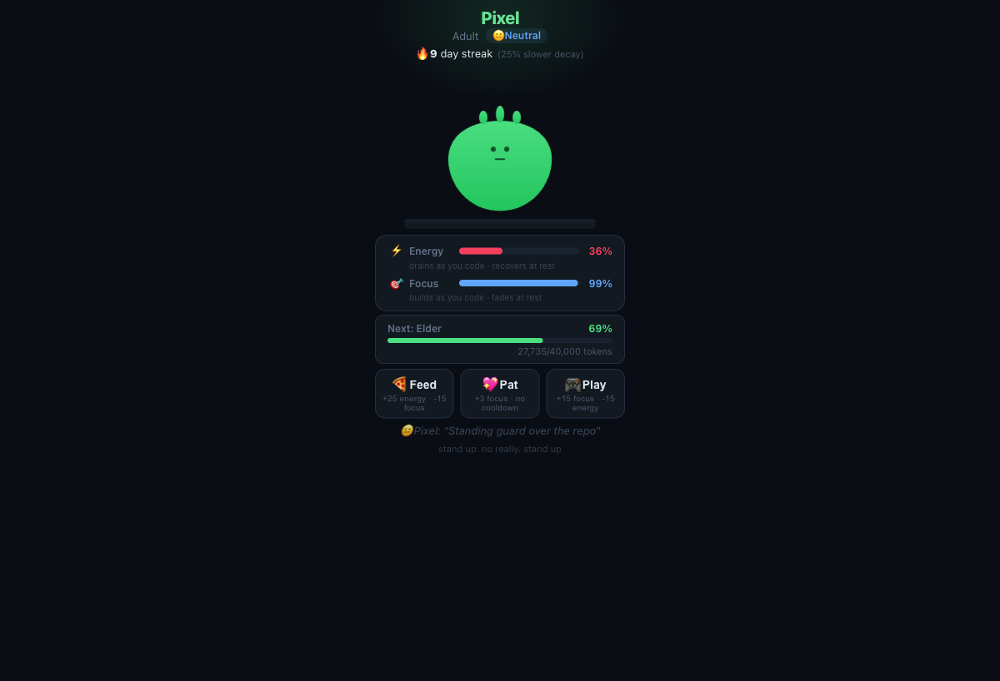

# claude-pet

A virtual pet that lives inside [Claude Code](https://claude.ai/claude-code). It watches how you code and reacts — if you ship a lot, it's happy. Ignore it, and it gets sad.

Your pet evolves through 5 stages (egg -> baby -> teen -> adult -> elder), has mood-based animations, a streak counter, and lives in your macOS menu bar.



## How it works

claude-pet hooks into Claude Code's lifecycle events:

- **PostToolUse** — every tool call (edit, bash, grep, etc.) feeds your pet, building focus and lifetime tokens
- **SessionStart** — shows your pet's status in the terminal when you start a session
- Energy recovers passively over time. Focus decays when you're away.
- Streaks reward consistency — longer streaks slow focus decay

## Features

- 5 evolution stages based on lifetime token accumulation
- 5 moods: happy, neutral, tired, sad, neglected
- Mood-specific animations (music notes, zzz, teardrops, etc.)
- Streak system with milestone rewards (7, 30, 100 days)
- Interactive actions: feed, play, pat
- macOS menu bar app (Electron)
- Web dashboard on localhost:7742
- ASCII art in the terminal via `/pet`

## Install

### 1. Clone the repo

```bash
git clone https://github.com/melonhead629/claude-pet.git ~/.claude/tamagotchi
```

### 2. Initialize your pet

```bash
node ~/.claude/tamagotchi/pet-engine.js init "YourPetName"
```

### 3. Add hooks to Claude Code

Add the following to your `~/.claude/settings.json` (or merge into your existing hooks config):

```json
{
  "hooks": {
    "PostToolUse": [
      {
        "matcher": "",
        "hooks": [
          {
            "type": "command",
            "command": "~/.claude/tamagotchi/hooks/post-tool-use.sh",
            "timeout": 5
          }
        ]
      }
    ],
    "SessionStart": [
      {
        "matcher": "",
        "hooks": [
          {
            "type": "command",
            "command": "~/.claude/tamagotchi/hooks/session-start.sh",
            "timeout": 5
          }
        ]
      }
    ]
  }
}
```

### 4. (Optional) Menu bar app

```bash
cd ~/.claude/tamagotchi/menubar
npm install
npx electron .
```

### 5. (Optional) Web dashboard

```bash
node ~/.claude/tamagotchi/pet-engine.js dashboard
```

Opens at [http://localhost:7742](http://localhost:7742).

## CLI commands

```bash
node pet-engine.js init [name]       # Create your pet
node pet-engine.js status            # Full ASCII status display
node pet-engine.js status-brief      # One-line status (used by hooks)
node pet-engine.js feed <tool>       # Feed your pet (called by hooks)
node pet-engine.js play              # Play with your pet (+focus, -energy)
node pet-engine.js manual-feed       # Give a snack (+energy, -focus)
node pet-engine.js pat               # Pat your pet (+focus)
node pet-engine.js name <new-name>   # Rename your pet
node pet-engine.js dashboard         # Open web dashboard
node pet-engine.js menubar           # Launch menu bar app
```

## Game mechanics

| Stat | How it works |
|------|-------------|
| **Energy** | Spent by coding activity and playing. Recovers passively over ~33 hours. |
| **Focus** | Gained from coding activity and playing. Decays over ~12 hours when idle. |
| **Mood** | Derived from average of energy + focus. Ranges from happy (70+) to sad (<20). |
| **Streak** | Increments daily when you use Claude Code. Longer streaks slow focus decay. |
| **Evolution** | Based on lifetime tokens earned from tool usage. 5 stages from egg to elder. |

## Customization

Your pet's color and name can be changed through the web dashboard or menu bar app settings panel.

Available colors: slime, ocean, ember, violet, gold, frost, coral, midnight.

## Requirements

- [Claude Code](https://claude.ai/claude-code) (CLI)
- Node.js 18+
- macOS (menu bar app is Electron-based, dashboard works anywhere)

## License

MIT
